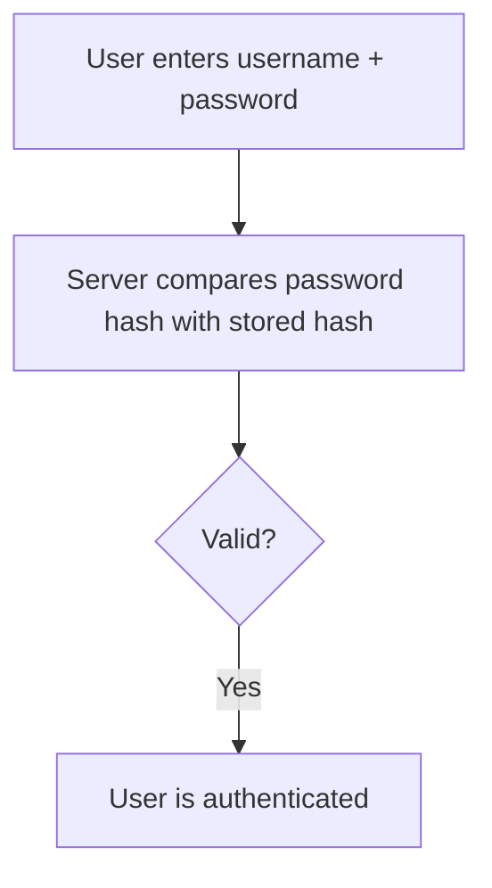
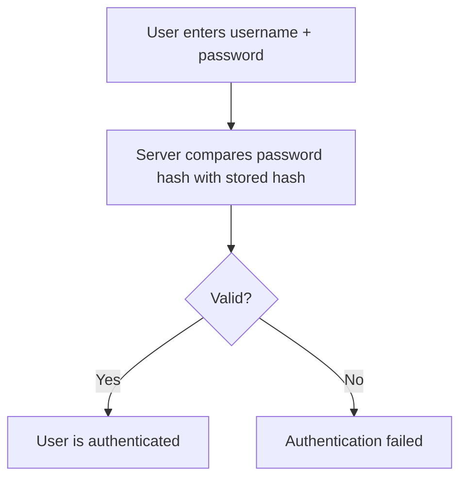
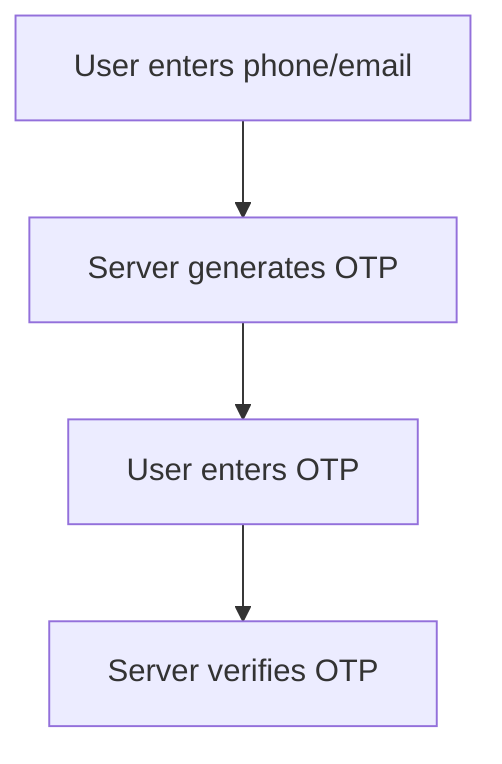
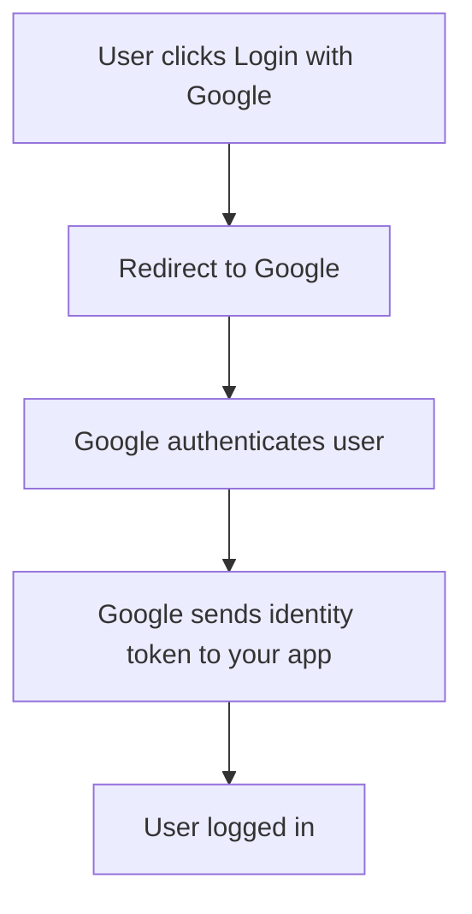

export const meta = {
    title: 'How Authentication Works in Modern Web Apps',
    date: '2026-03-08',
    updated: '2026-03-08',
    description: 'A practical guide on Authentication and Authorization you can bookmark',
    tags: ['javascript', 'security']
};

# Authentication vs Authorization

## Authentication

<Tip> Who is the user?</Tip>

Authentication is the process of verifying a user's identity.
When you log into an application:

1. You enter your username and password

2. The server checks whether the credentials match what is stored in its database (add a link to this section)

3. If they match, the system considers you authenticated

## Authorization

<Tip>What is the user allowed to access or perform?</Tip>

Authorization determines what an authenticated user is allowed to do.
After a system knows who the user is, it must decide what resources or actions that user can access.

<Tip>
    Authentication verifies identity.
      Authorization determines permissions.
</Tip>

## Different Authentication methods

This layer deals with how identity is verified.

Things the user has to know

### Username and password

User needs to enter a unique username/email and enter a password they have to remember somehow. (this should link to password managers or advise about using offline notetaking apps)
Flow:

#### Key concepts:

-   Password hashing (bcrypt, argon2)

-   Salting

-   Credential storage

#### Pros

-   Simple

-   Widely supported

#### Cons

Weak passwords

Phishing risk

Credential leaks

Need for a password manager for lot of accounts

#### Use cases (what kind of apps typically use them)

#### System design

### PIN (TODO: write more)

Short description:
Flow:
Pros
Cons
Use Cases
System design

Something you have

### One-Time Password (OTP)

A temporary code sent to the user.

Flow:

**Can be down through the following ways:**

-   SMS OTP

-   Email OTP

-   Authenticator apps

**Pros**

-   No password required

-   Good for verification

**Cons**

-   SMS can be intercepted (TODO: how does this work)

-   Delivery delays (TODO: when does this happen)

**System design**

### Hardware security key

> Authentication apps

Something you are

### Biometric Authentication

Uses physical characteristics.

Biometrics usually unlock a credential stored on the device rather than directly authenticating with the server.

-   Fingerprint

-   Face recognition

-   Retina scan

**Use Cases**

-   Mobile devices

-   Banking apps

### Multi-Factor Authentication (MFA)

Many systems combine multiple methods, which is known as multi-factor authentication (MFA).

### Social Login / OAuth

Login using another service.

Flow:

**Examples:**

Google login

GitHub login

Apple login

TODO: what is this OAuth i keep hearing about?

## Different Authentication systems

This deals with how login state in maintained.
Because HTTP is stateless.

### Session-Based Authentication

### Token-Based Authentication

## How refresh tokens Work

## Authorization models

### Role based access control (RBAC)

### Attribute based acces control (ABAC)

### Permission based systems

This deals with how permissions are enforced.

## Various Saas solutions

## Common web security threats

## Authentication and authorization on mobile

### How does the server check whether the credentials match what is stored in its database

TODO: where does my physical bitcoin walled stand? and how is its auth implemented?

TODO: add published papers

TODO: Explain SSO
