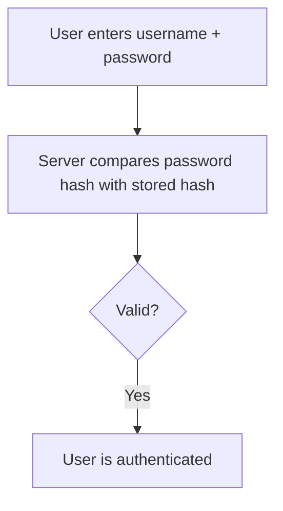

export const meta = {
    title: 'How Authentication Works in Modern Web Apps',
    date: '2026-03-08',
    description: 'A practical guide on Authentication and Authorization you can bookmark',
    tags: ['authentication', 'security']
};

# Authentication vs Authorization

## Authentication

<Tip> Who is the user?</Tip>

Authentication is the process of verifying a user's identity.
When you log into an application:

1. You enter your username and password

2. The server checks whether the credentials match what is stored in its database (add a link to this section)

3. If they match, the system considers you authenticated

## Authorization

<Tip>What is the user allowed to access or perform?</Tip>

Authorization determines what an authenticated user is allowed to do.
After a system knows who the user is, it must decide what resources or actions that user can access.

<Tip>
    Authentication verifies identity.
      Authorization determines permissions.
</Tip>

## Different Authentication methods

This layer deals with how identity is verified.

### Username and password

-   use cases (what kind of apps typically use them)
    > PIN

### Something you have

> OTP sent to your phone

> Hardware security key

> Authentication apps

### Something you are

> Fingerprint

> Face recognition

> Retina scan

Many systems combine multiple methods, which is known as multi-factor authentication (MFA).

## Different Authentication systems

This deals with how login state in maintained.

## Authorization models

This deals with how permissions are enforced.

## Various Saas solutions

### How does the server check whether the credentials match what is stored in its database
